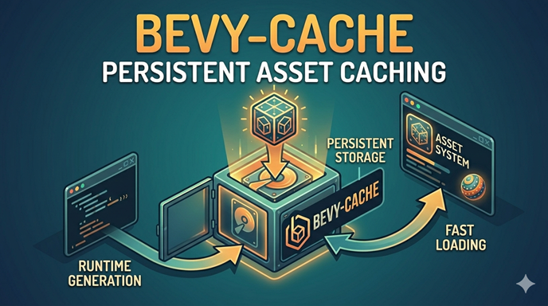

  

---

# Bevy Cache

A caching library for Bevy that provides a manifest-based cache for storing and retrieving assets with expiration and persistence support.

> [!NOTE]
> I designed this for my personal use, however, I am publishing it here in case it is useful to others and welcome feedback, issues, and contributions.

## Features

- Manifest-based cache that tracks cached assets and their metadata
- Store and retrieve assets by key
- Automatic expiration of cached entries based on global or per-entry max age
- Persistence of the cache manifest to disk so the cache survives application restarts
- Removal of expired or individual cache entries
- Support for generating `cache://` asset paths for use in Bevy asset loading

## Usage

Add the `BevyCachePlugin` to your Bevy app, passing in a unique application name that will be used to determine the cache directory.

Use this for caching assets that you want to persist across runs of your Bevy app, optionally with expiration, and to be able to load them via `cache://` paths in the Bevy asset system.

## Examples

See [examples](/examples/).

## Compatibility

### bevy

| bevy | bevy-cache |
|------|------------|
| 0.18 | 0.1        |

## Contributing

Contributions are welcome! Please open issues or submit pull requests to contribute improvements, bug fixes, or new features.

## License

This project is licensed under the MIT License. See the [LICENSE](LICENSE) file for details.
